[](https://github.com/spiraldb/spiraldb-nemo-curator/actions/workflows/ci.yml?query=branch%3Adevelop)
[](LICENSE)

# SpiralDB source for NVIDIA NeMo Curator


SpiralDB-backed I/O endpoints for [NVIDIA NeMo Curator][nemo] video pipelines.
This library provides two drop-in replacements for Curator's file-based I/O
stages:

| this library         | replaces                                                                                                                                            | role                                            |
| -------------------- | --------------------------------------------------------------------------------------------------------------------------------------------------- | ----------------------------------------------- |
| `SpiralVideoReader`  | [`VideoReader`](https://docs.nvidia.com/nemo/curator/nemo-curator/nemo_curator/stages/video/io/video_reader#nemo_curator-stages-video-io-video_reader-VideoReader)        | reads source MP4s into `VideoTask`s             |
| `SpiralClipWriter`   | [`ClipWriterStage`](https://docs.nvidia.com/nemo/curator/latest/nemo-curator/nemo_curator/stages/video/io/clip_writer#nemo_curator-stages-video-io-clip_writer-ClipWriterStage) | writes per-clip outputs at the end of the pipeline |

Swap those two stages in and your raw MP4s, per-clip MP4s, previews, captions,
and embeddings all live in a single SpiralDB table — no S3 prefixes to babysit,
no JSON sidecar files, no Parquet shards to compact.

The middle of the pipeline (clip extraction, motion / aesthetic filtering,
Cosmos-Embed1, captioning) is reused unchanged from `nemo_curator`. Only the
endpoints change.

## Install

```bash
uv init my-curation-project
cd my-curation-project
uv add nemo-curator git+https://github.com/spiraldb/spiraldb-nemo-curator
```

## Quickstart

Assumes a Spiral project with an `input_videos` table whose key column is
`clip_id` and whose `video` column is an `se.Blob` of MP4 bytes. The `clips`
output table is auto-created on first run.

```python
import os

from nemo_curator.pipeline.pipeline import Pipeline
from nemo_curator.stages.video.clipping.clip_extraction_stages import (
    FixedStrideExtractorStage,
)
from nemo_curator.stages.video.clipping.clip_transcoding_stages import (
    ClipTranscodingStage,
)
from nemo_curator.stages.video.clipping.frame_extraction import FrameExtractionStage

from spiraldb_nemo_curator.io.video import SpiralClipWriter, SpiralVideoReader

project = os.environ["SPIRAL_PROJECT"]

pipeline = Pipeline(name="quickstart")
pipeline.add_stage(
    SpiralVideoReader(
        project_id=project,
        table_name="input_videos",
        video_column="video",
        source_id_column="clip_id",
    )
)
pipeline.add_stage(FrameExtractionStage())
pipeline.add_stage(FixedStrideExtractorStage())
pipeline.add_stage(ClipTranscodingStage(encoder="libopenh264"))
pipeline.add_stage(
    SpiralClipWriter(project_id=project, table_name="clips")
)

pipeline.run()
```

A fuller example with TransNetV2, motion filtering, Cosmos-Embed1, and
captioning lives in [`examples/spiral_pipeline.py`](examples/spiral_pipeline.py).

## Architecture

```mermaid
flowchart LR
    Src[(SpiralDB<br/>input_videos)]

    subgraph reader["SpiralVideoReader (this library)"]
        direction TB
        P[SpiralPartitionStage<br/>keys-only scan]
        R[SpiralVideoReaderStage<br/>keyed point-scan]
        P --> R
    end

    subgraph curator["NeMo Curator stages (unchanged)"]
        direction TB
        F[FrameExtraction]
        C[ClipExtraction<br/>TransNetV2 / FixedStride]
        T[ClipTranscoding]
        M[Motion / Aesthetic filters]
        E[CosmosEmbed1]
        Cap[CaptionGeneration]
        F --> C --> T --> M --> E --> Cap
    end

    W[SpiralClipWriter<br/>this library]
    Dst[(SpiralDB<br/>clips)]

    Src --> P
    R --> F
    Cap --> W
    W --> Dst
```



`SpiralVideoReader` is a [`CompositeStage`][composite-stage] that decomposes
into two [`ProcessingStage`s][processing-stage]: a cheap keys-only scan (one
task per source row) followed by a keyed point-scan that materializes the blob
payload — so workers fan out over rows without serializing the source table
across the cluster. `SpiralClipWriter` is a single `ProcessingStage` that
writes both `video.clips` and `video.filtered_clips` in one batched
`tbl.write()`, with each `se.Blob` column landing in its own column group.

[composite-stage]: https://docs.nvidia.com/nemo/curator/latest/nemo-curator/nemo_curator/stages/base#nemo_curator-stages-base-CompositeStage
[processing-stage]: https://docs.nvidia.com/nemo/curator/latest/nemo-curator/nemo_curator/stages/base#nemo_curator-stages-base-ProcessingStage

## Contact

Questions, design feedback, or want help wiring this into your pipeline?
Email [nemo-curator@spiraldb.com](mailto:nemo-curator@spiraldb.com?subject=NeMo%20Curator)
and mention **NeMo Curator** in the subject line.

[nemo]: https://github.com/NVIDIA/NeMo-Curator
